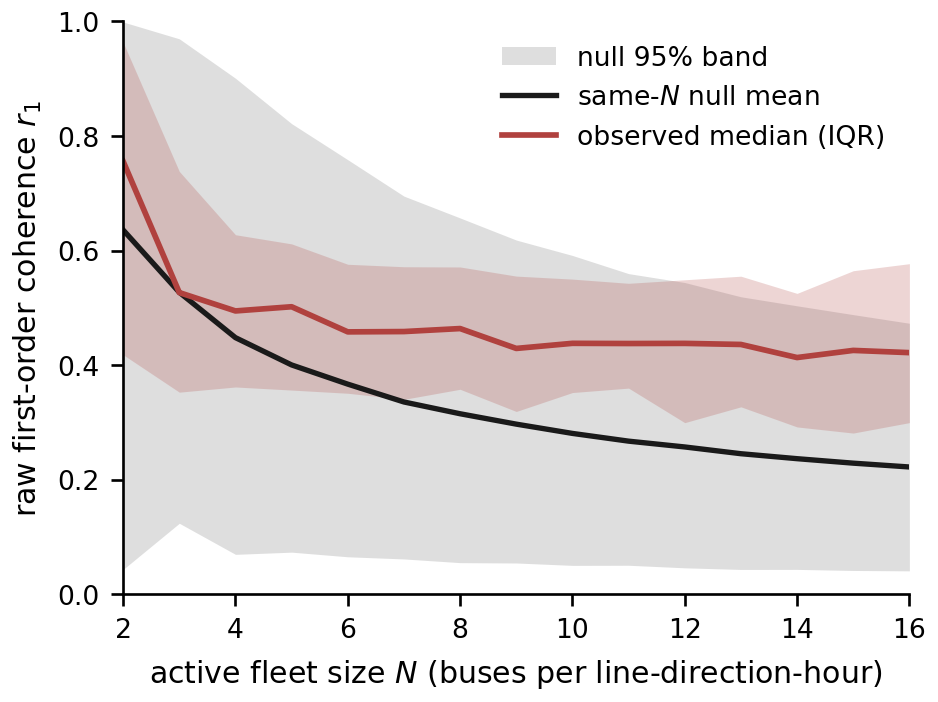
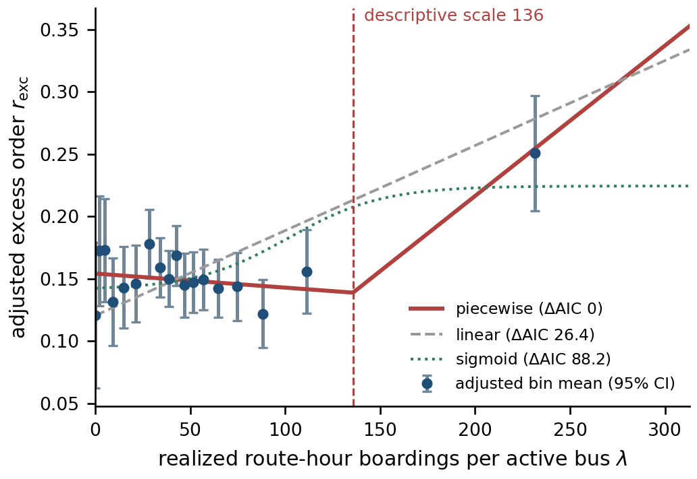
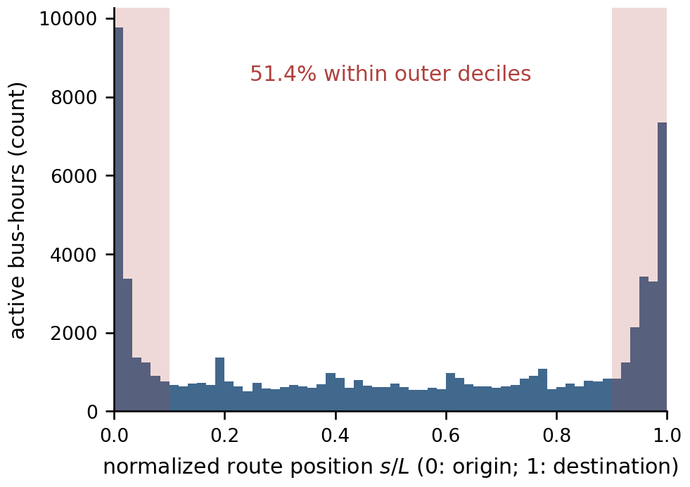
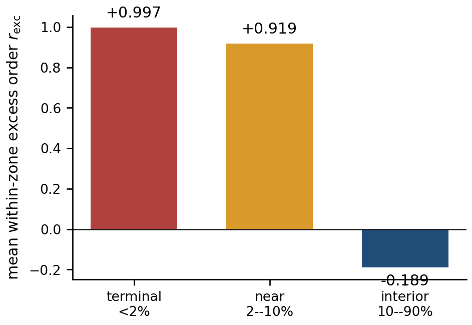
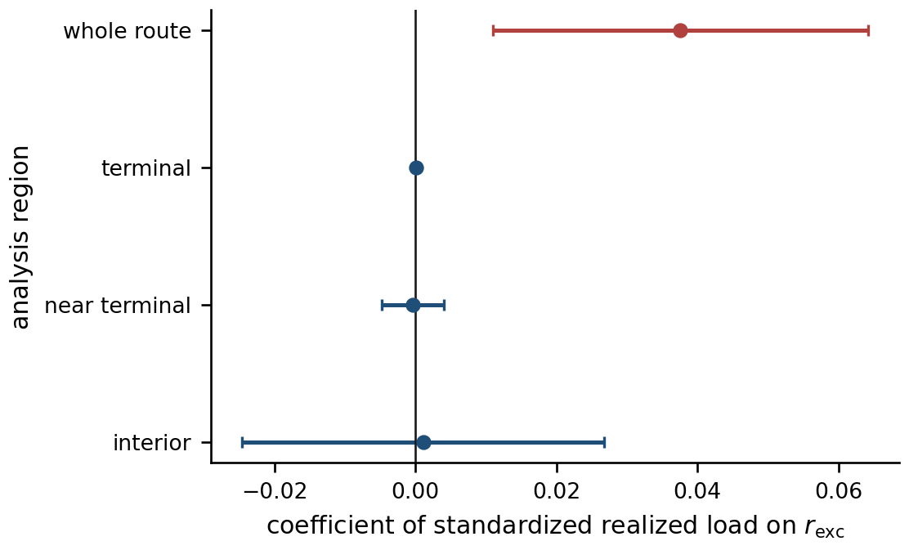

# Finite-size-corrected synchronization in a city-scale bus network

## Crossover, not demonstrated criticality

I study whether bus bunching in Niterói, Brazil can be identified as a synchronization transition from city-scale observations. The usual Kuramoto order parameter rises when buses occupy similar positions along a route, but two features of this dataset complicate that interpretation: hourly fleets are small and variable, and a bus route is an open line whose two terminals become adjacent after position is mapped to a circular phase.

The analysis uses 13,850,467 GPS fixes and 6,790,681 ticket records collected from 11–31 March 2026. After route selection and quality controls, the sample contains 20 routes, 40 directions, 69,466 active bus-hours, and 10,135 analysis-eligible line-direction-date-hour cells. The main result is not a critical point. A load association remains after correcting the finite-fleet baseline, but the transition diagnostics do not identify criticality, and much of the whole-route coherence comes from buses occupying terminal regions.

This repository is the compact companion to the camera-ready paper. It contains the five figures used in that paper, a self-contained Python script that recreates them, and the complete longer report. Raw mobility records, analysis tables, and the larger research working directory are intentionally not included.

## Research question

A delayed bus serves passengers accumulated over a longer headway, dwells longer, and loses more time. The following bus encounters fewer passengers and may catch up. This directed feedback can create bunching, but a rising order parameter does not by itself show a phase transition.

The empirical question is therefore narrower:

> After accounting for fleet size, route geometry, and terminal occupancy, do the data support a load-driven critical synchronization transition?

Three distinctions matter throughout the analysis:

1. **Raw coherence versus excess coherence.** A small random fleet has a large order parameter even when bus phases are independent.
2. **Descriptive crossover versus critical point.** A fitted change in slope is not sufficient evidence of criticality.
3. **Whole-route order versus in-service spacing.** Terminal queues and interior headways describe different operating states.

## Data and identification

The GPS and ticket datasets use different vehicle identifiers. The 527 telemetry hardware IDs and 556 operator vehicle numbers have no overlap, and the release provides no crosswalk between them. Tickets therefore cannot be assigned to individual GPS buses. The two sources are joined only by normalized route and local hour.

For route $\ell$, direction $d$, and hour $t$, realized load is

$$
\lambda_{\ell d t}=\frac{B_{\ell t}}{N_{\ell d t}},
$$

where $B_{\ell t}$ is the number of route-hour boardings and $N_{\ell d t}$ is the number of active GPS buses in that direction. Because tickets contain no direction, the two directions share the boarding numerator but retain separate active-bus denominators.

This quantity is **realized boardings per active bus**. It is not vehicle-level passenger load, exogenous demand, or a causal treatment: the denominator is an operating decision and can respond to expected demand and service conditions.

## From route position to corrected order

For a bus at arc position $s$ on a route of length $L$, the conventional phase coordinate is

$$
\phi_{\mathrm{arc}}=2\pi s/L.
$$

For $N$ active buses in one hourly cell, the first circular order parameter is

$$
r_1=\left|\frac{1}{N}\sum_{j=1}^{N}e^{i\phi_j}\right|.
$$

Under independent uniform phases, $Nr_1$ is the endpoint distance of an $N$-step planar random walk. The baseline is therefore not zero. Its large-$N$ approximation is

$$
E[r_1]\simeq\frac{\sqrt{\pi}}{2\sqrt{N}}\approx\frac{0.8862}{\sqrt{N}},
$$

but the median cell in this study contains only six buses, so the exact finite-$N$ behavior matters. I use a same-$N$ simulated null and report excess order as

$$
r_{\mathrm{exc}}=\frac{r_1-\mu_N}{1-\mu_N},
$$

where $\mu_N$ is the null mean for that fleet size. A value of zero matches the specified null, a positive value indicates more phase concentration, and a negative value indicates spacing more even than that null.

## Results

### 1. Raw order has a fleet-size-dependent baseline



**Figure 1.** Observed medians must be read against the same-$N$ null rather than compared directly across fleet sizes. Raw coherence near 0.6 for a two-bus cell is largely an estimator baseline, not evidence that those two buses are dynamically coordinated.

Fleet size also changes the weekend comparison. Raw arc-phase $r_1$ is 0.045 higher on weekends while mean fleet size falls from 7.99 to 4.47. Exact matching within $N$ reduces that raw contrast to 0.014. After same-$N$ correction, the marginal weekend-minus-weekday contrast is $-0.068$, whereas the matched contrast is $+0.012$. These estimates answer different questions: the marginal contrast includes the weekend supply pathway through $N$, while the matched contrast compares day types at the same fleet size.

### 2. The load curve changes slope, but the fitted scale is not a critical point



**Figure 2.** Corrected order is positively associated with realized load after line-direction and operating controls. On the same fixed-effect frame, the piecewise model has AIC 10308.21, compared with 10334.61 for the linear model and 10396.36 for the sigmoid model. The fitted slope change occurs at 135.74 boardings per active bus.

I treat 135.74 as a descriptive operating scale. Of the three predeclared criticality checks, susceptibility has no interior peak, near-scale bimodality is weaker than the off-scale comparison, and only stability across fleet-size strata passes. Free-exponent scaling collapse is sensitive to starting values and reaches exponent bounds, so its exponents are reported as unidentified. The evidence supports a smooth crossover, not a demonstrated critical transition.

### 3. Half of the representative bus-hours lie near route ends



**Figure 3.** After the layover rule is applied, 27.19% of active bus-hours remain within 2% of a route end and another 24.18% lie between 2% and 10%. In total, 51.37% of representative bus-hours are in the outer route deciles. Similar median route-matching residuals in terminal, near-terminal, and interior zones make projection error an unlikely explanation for this concentration.

### 4. Corrected order reverses sign between terminals and the route interior



**Figure 4.** Fleet size and the order parameter are recomputed separately inside each zone. Mean excess order is 0.9974 in the outer 2%, 0.9186 from 2–10%, and $-0.1887$ in the 10–90% interior. The terminal value reflects near-complete concentration in the circular coordinate. The negative interior value means that buses are more evenly spaced than the same-$N$ uniform reference; it is consistent with a splay-like state but does not prove successful dispatch control.

Endpoint trimming gives the same qualitative result: removing 2% from each end changes mean arc-phase excess order from 0.155 to $-0.120$, and a 5% trim gives $-0.223$.

### 5. The whole-route load association is not detected within zones



**Figure 5.** In the whole-route fixed-effect model, the standardized load coefficient is 0.03758 with a 95% confidence interval of [0.01097, 0.06420]. The corresponding interior estimate is 0.00111 with interval [$-0.02460$, 0.02683] and $p=0.9325$; neither terminal zone has a detected coefficient. Lack of detection is not evidence that the true within-zone effects are exactly zero.

Adding terminal fraction directly to the whole-route model reduces the load coefficient from 0.03758 to 0.02106, an attenuation of 44%. Terminal fraction itself has coefficient 1.2386. Spatial composition therefore explains a substantial part of the whole-route association, but the residual coefficient and the change in within-zone fleet size prevent a claim of complete mediation.

## What the analysis supports

The conventional circular order parameter makes the Niterói fleet look Kuramoto-like, but that appearance depends strongly on fleet size and on wrapping an open route onto a circle. After finite-$N$ correction, a positive association with realized boardings per active bus remains, together with a descriptive change in slope. The susceptibility and scaling diagnostics do not identify a critical point.

Route position changes the physical reading. Terminal and interior order have opposite signs, within-zone load coefficients are not detected, and terminal-fraction control removes 44% of the whole-route load coefficient. The supported interpretation is a load-modulated operational crossover embedded in terminal occupancy, not a demonstrated city-scale synchronization transition.

## Limits of the inference

- GPS and ticket vehicle identifiers cannot be linked, so realized load is measured at route-hour resolution.
- The active-bus denominator is endogenous to service planning and operating conditions.
- One representative position per bus-hour compresses movement within the hour.
- Same-$N$ nulls do not reproduce every directed interaction, control action, or dispatch rule.
- Restricting the route to a zone changes both occupancy and the fleet size used in the estimator.
- The observation window covers 19 days in one city; terminal concentration should be tested in other networks.

These limits are part of the interpretation. The analysis identifies where the conventional synchronization claim fails; it does not claim that buses never interact or that a transition is impossible in another dataset.

## Recreate the five paper figures

The plotted values are frozen directly inside the Python script, so the figures can be recreated without downloading the raw GPS and ticket files or publishing CSV/JSON result tables.

```bash
python -m venv .venv
source .venv/bin/activate
python -m pip install -r requirements.txt
python code/make_paper_figures.py
```

The command rewrites the five PDF and PNG pairs in `output/figures/`. PDFs are the publication versions; PNGs are included so GitHub can display the figures in this README.

The plotting environment used for the checked outputs is recorded in [`requirements.txt`](requirements.txt). An alternative output location can be supplied when needed:

```bash
python code/make_paper_figures.py \
  --figure-dir /path/to/figures
```

## Repository contents

```text
.
├── code/
│   └── make_paper_figures.py
├── output/
│   └── figures/                 # camera-ready and full-report figures
├── report/
│   └── NetMob_2026_full_report.pdf
├── .gitignore                   # explicit publication allowlist
├── README.md
└── requirements.txt
```

The published repository is deliberately narrower than the research working directory. It recreates the camera-ready figures from values embedded in the plotting script; it does not claim to rebuild the estimates from the raw challenge data. This boundary keeps the repository aligned with the submitted paper without publishing intermediate or tabular analysis outputs.

## References used in the paper

1. V.-L. Saw, N. N. Chung, W. L. Quek, Y. E. I. Pang, and L. Y. Chew, “Bus bunching as a synchronisation phenomenon,” *Scientific Reports* **9**, 6887 (2019).
2. M. Vinck, M. van Wingerden, T. Womelsdorf, P. Fries, and C. M. A. Pennartz, “The pairwise phase consistency: a bias-free measure of rhythmic neuronal synchronization,” *NeuroImage* **51**, 112–122 (2010).
3. J. C. Kluyver, “A local probability problem,” *Proceedings of the Section of Sciences, Koninklijke Akademie van Wetenschappen* **8**, 341–350 (1905).
4. F. Domingos, H. T. Marques-Neto, B. Pereira, C. Celes, S. Knoblauch, and V. F. S. Mota, “The NetMob26 dataset: a high-resolution multi-source view of public bus mobility in Niterói,” arXiv:2605.20263 (2026).

## Author

Po-Hsun Lai<br>
Department of Physics, National Taiwan University<br>
b11202025@ntu.edu.tw

## Full report

The complete report, including the extended methods, finite-size theory, model-discrimination tests, result tables, additional mechanism figures, discussion, and references, can be read in [`report/NetMob_2026_full_report.pdf`](report/NetMob_2026_full_report.pdf).
